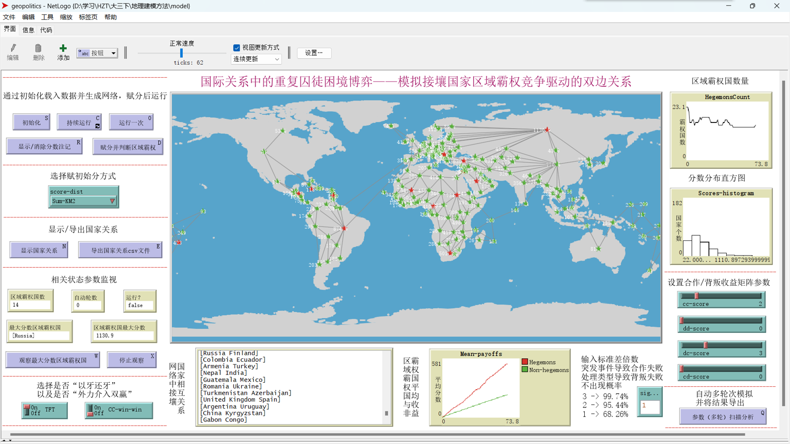

# geopolitics
**国际关系中的重复囚徒困境博弈——模拟接壤国家区域霸权竞争驱动的双边关系**

python文件用作模型所得数据分析所用
# Home page and principle
 

# What is it?
&emsp;&emsp;本模型为武汉大学遥感信息工程学院2020级本科生黄梓涛为完成贾涛老师《地理建模方法》课程结课要求编写的Netlogo模型。 
&emsp;&emsp;在国际关系中，邻国之间的双边关系会受到区域霸权竞争的严重影响。当各国争夺地区主导地位时，其与邻国的互动可能受到战略关切、资源配置和地缘政治定位的驱动。为了更好地理解这一现象，将囚徒困境的概念与国际关系中地缘政治竞争相结合，我们可以在NetLogo中创建一个简单的基于代理的模型，主题为**模拟接壤国家区域霸权竞争驱动的双边关系**。 
&emsp;&emsp;经典的博弈论问题“囚徒困境”经常被用于国际关系研究中以模拟国家之间的互动。囚徒困境是博弈论中经典的问题之一，通常描述为两个囚犯被捕，但警方缺乏足够的证据来定罪。警方将每个囚犯单独关押，并向他们提供一个选择：合作或背叛。如果两个囚犯都选择合作，那么他们会得到轻判；如果两个囚犯都选择背叛，那么他们会得到重判；如果一个囚犯选择背叛而另一个选择合作，那么背叛的囚犯将会被释放，而合作的囚犯将会得到重判。囚徒困境的一个重要结论是，在没有外部机构监督和强制执行合作的情况下，囚徒困境的参与者通常会选择背叛，这会导致不利的结果。然而，当参与者有机会建立互信并建立可持续的合作时，囚徒困境的结果可能会得到改善。 
&emsp;&emsp;在国际关系领域中，一些大国之间的双边关系受到了这些大国在某个地理区域内的霸权地位的影响。这些大国之间的互动不仅受到彼此的利益和意识形态等因素的影响，同时还受到这些国家在特定区域内的实力对比的影响。在这种情况下，一些大国可能会试图在某个地理区域内扩大自己的影响力，从而在双边互动中占据更有利的地位。这种双边互动的结果，可能会影响到整个地理区域的政治和经济发展，进而影响到国际体系的稳定和平衡。 
&emsp;&emsp;在本模型中，在使用 GIS 扩展派生的基于现实世界地理数据的国家级代理网络中实现了一个重复囚徒困境模型，并模拟了接壤国家之间的区域霸权驱动的局部互动，可以观察到各国家代理通过与各方邻国的单独决策方案实施后最终获得的收益与区域地位变化。

# How it works?
## 国家代理网络生成：
1. 取每个国家Ploygon的质心坐标作为代理坐标生成国家代理，以确定网络节点；
2. 在任何两个共享边界的国家之间建立联系；
3. 将每个未连接的国家连接到最近的两个国家来避免孤岛；
4. 手动整理那些因Shapefile文件问题导致本应连接但未连接的联系。

## 赋初始分与判断区域霸权：
1. 赋初始分通过四种方式实现，包括标准正态分布随机赋分、均值为10的指数分布随机赋分、Shapefile文件属性字段中的标准GDP赋分和Shapefile文件属性字段中的国土总面积赋分等；
2. 判断霸权的方式为，在连接的邻居中（含本身）初始分数最大即为霸权。

## 模拟运行：
1. 设置程序停止符，停止条件为局部相对排名不变；
2. 更新代理评估，评估所有的网络邻居，以找到整体的局部排名和相对自己强一位/相对自己弱一位的邻居。同时相应地更新策略，对单个国家而言，相对排位根据情况变化，和所有邻国合作，但并非绝对，需要看概率确定最终是否合作（如可能会出现突发事件导致无法合作等），概率函数选取的是标准正态分布（大概率选择合作）。如果有外力介入（如外部机构监督和强制执行合作），建立互信并建立可持续的合作，开启了合作共赢模式，则对相对自己强一位/相对自己弱一位的国家均用合作方式。如果没有，则背叛相对自己强一位/相对自己弱一位，同样看概率（如执政党理性或非理性或其他利益考量等），概率函数同样选取的是标准正态分布（大概率选择背叛）；
3. 计算收益，根据每对网络对象的行动计算收益，收益矩阵为
			合作                              背叛
	合作 cc-score,cc-score  cd-score,dc-score
	背叛 dc-score,cd-score  dd-score,dd-score
4. 模仿对方，如果选择了以牙还牙方式（Tit for Tat），就按策略方式对对策表进行更新，在该策略中，一个人的选择依赖于上一轮对手的选择。如果对手合作，它会合作；如果对手背叛，它也会背叛。
5. 参数扫描，通过自动多轮次的模拟，生成多次模拟该过程的结果并导出为csv文件，得到大量实验模拟结果以便分析。

# How to use it?
## 按钮：
### 初始化
&emsp;&emsp;&emsp;&emsp;加载并绘制Shapefile数据，生成国家代理并建立交互网络

### 持续运行
&emsp;&emsp;多次更新评估与计算收益，更新绘图，停止条件为局部区域相对排名不变（注：需先点击赋分并判断区域霸权）

### 运行一次
&emsp;&emsp;单次更新评估与计算收益，更新绘图（注：需先点击赋分并判断区域霸权）

### 显示/消除分数注记
&emsp;&emsp;显示/消除当前网络中节点的当前分数标签

### 赋分并判断区域霸权
&emsp;&emsp;根据所选的赋初始分方式给网络各节点赋分，并对每一节点进行是否邻域最大判断，区域霸权国用加红的五角星表示

### 显示国家关系
&emsp;&emsp;在输出区输出当前网络中接壤国家相互关系

### 导出国家关系csv文件
&emsp;&emsp;在nlogo文件同目录路径处生成当前网络中接壤国家相互关系的csv文件

### 观察最大分数区域霸权国
&emsp;&emsp;聚焦拥有最大分数的区域霸权国，并调出对应视图与属性窗口

### 停止观察
&emsp;&emsp;恢复未观察状态，关闭视图与属性窗口

### 参数（多轮）扫描分析
&emsp;&emsp;自动多轮随机赋分值模拟多次接壤国家区域霸权竞争驱动的双边关系（500次标准正态分布随机赋分，500次均值为10的指数分布随机赋分，每次运行60遍）

## 滑块：
&emsp;&emsp;设置合作/背叛收益矩阵参数
"cc-score"为两者均选择合作则得相应分数
"dd-score"为两者均选择背叛则得相应分数
"dc-score"为一方选择合作而选择背叛的另一方得相应分数
"cd-score"为一方选择背叛而选择合作的另一方得相应分数

## 开关：
### TFT开关
&emsp;&emsp;开则选择采用“以牙还牙”方式，选择依赖于上一轮对方的选择，对方上一轮选择了什么方案己方这一轮就选择什么方案，关则无此策略过程

### CC-win-win开关
&emsp;&emsp;开则选择采用“合作共赢”方式，对相对自己强一位/相对自己弱一位的国家均用合作方式，关则无此策略过程

## 选择器：
&emsp;&emsp;选择赋初始分的方式，包括：
标准正态分布随机赋分
均值为10的指数分布随机赋分
Shapefile文件属性字段中的标准GDP赋分
Shapefile文件属性字段中的国土总面积赋分

## 输入框：
&emsp;&emsp;输入标准正态分布标准差倍数，出现概率对应为：
1->68.26%
2->95.44%
3->99.74%
其他数字->详见对应概率表格

## 监视器：
### 霸权国数
&emsp;&emsp;当前网络中区域霸权国数量

### 自动轮数
&emsp;&emsp;参数（多轮）扫描分析自动运行的当前轮数

### 运行？
&emsp;&emsp;是否到达持续运行（未达到停止判定）条件

### 最大分数区域霸权国
&emsp;&emsp;当前网络中最大分数的区域霸权国的名称

### 区域霸权国最大分数
&emsp;&emsp;当前网络中最大分数的区域霸权国的分数

## 图：
### 区域霸权国数量
&emsp;&emsp;区域霸权国数随模拟运行次数变化图，横坐标为模拟运行次数，纵坐标为区域霸权国数

### 分数分布直方图
&emsp;&emsp;当前网络中各国家分数的分布直方图，横坐标为各种分数（限制为10个区间），纵坐标为对应国家个数

### 区域霸权国与非霸权国平均收益
&emsp;&emsp;区域霸权国与非霸权国平均收益随模拟运行次数变化图，横坐标为模拟运行次数，纵坐标为区域霸权国与非霸权国平均收益，红色为区域霸权国，绿色为非霸权国

## 输出区：
&emsp;&emsp;输出当前网络中接壤国家相互关系

# Extending the model
## 优化和创新，包括以下几点：
1. 人工智能技术：可以引入机器学习或其他人工智能技术，如强化学习、深度学习等，来优化参与者的策略，使得模拟更加准确，同时可以探讨人工智能在国际关系中的应用。
2. 网络结构：可以将参与者之间的关系构建成特定网络结构，如小世界网络、无标度网络等，通过研究网络结构对博弈结果的影响，探讨网络结构在国际关系中的作用。
3. 真实模拟：为了更好地模拟现实世界的复杂性，可以根据需要向模型中添加更多变量，例如贸易、军事实力、外交政策、文化交流、国际组织成员资格等。同时可以考虑引入国家内部因素，如政治制度、经济发展水平和民族关系，以更好地理解国家决策和地缘政治竞争的动态。
4. 合作与背叛策略：根据经典囚徒困境策略（如以牙还牙、慷慨、怀疑等）为代理设计更多种合作与背叛策略。这将使模型能够更好地反映国家之间的战略互动。
5. 多层次互动：研究国家之间的双边关系和多边关系，以及这些关系如何相互影响地缘政治竞争。
6. 模拟不同国际体系：尝试在不同的国际体系下（如现实主义、自由主义或建构主义）对模型进行调整，以探究这些理论框架对地缘政治竞争的影响。
7. 敏感性分析和参数优化：对模型的参数进行敏感性分析，以更好地理解各种因素对模型输出的影响。此外，可以尝试通过参数优化来提高模型的预测能力和准确性。
